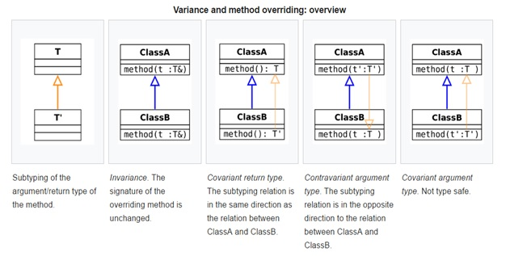

[Covariance and contravariance](https://en.wikipedia.org/wiki/Covariance_and_contravariance_(computer_science))
------------------------

The [type system](https://en.wikipedia.org/wiki/Type_system) of many [programming languages](https://en.wikipedia.org/wiki/Programming_language) supports [subtyping](https://en.wikipedia.org/wiki/Subtyping). By making type constructors covariant or contravariant instead of invariant, more programs will be accepted as well-typed. 

Within the [type system](https://en.wikipedia.org/wiki/Type_system) of a [programming language](https://en.wikipedia.org/wiki/Programming_language), a typing rule or a type constructor is:

-   *covariant* if it preserves the [ordering of types (≤)](https://en.wikipedia.org/wiki/Subtype), which orders types from more specific to more generic;

-   *contravariant* if it reverses this ordering;

-   *bivariant* if both of these apply (i.e., both I&lt;A&gt; ≤ I&lt;B&gt; and I&lt;B&gt; ≤ I&lt;A&gt; at the same time);

-   *invariant* or *nonvariant* if neither of these applies.

Read-only data types (sources) can be covariant; write-only data types (sinks) can be contravariant. Mutable data types which act as both sources and sinks should be invariant.

To illustrate this general phenomenon, consider the [array type](https://en.wikipedia.org/wiki/Array_data_type). For the type Animal we can make the type Animal[], which is an "array of animals". For the purposes of this example, this array supports both reading and writing elements.

Should we treat this as:
```
    -   Covariant: a Cat[] is an Animal[]
    -   Contravariant: an Animal[] is a Cat[]
    -   Invariant: an Animal[] is not a Cat[] and a Cat[] is not an Animal[]?
```

If we wish to avoid type errors, then only the third choice is safe. Clearly, not every Animal[] can be treated as if it were a Cat[], since a client reading from the array will expect a Cat, but an Animal[]may contain e.g. a Dog. So the contravariant rule is not safe.

Conversely, a Cat[] cannot be treated as an Animal[]. It should always be possible to put a Dog into an Animal[].

With covariant arrays this cannot be guaranteed to be safe, since the backing store might actually be an array of cats. So the covariant rule is also not safe—the array constructor should be invariant. Note that this is only an issue for mutable arrays; the covariant rule is safe for immutable (read-only) arrays.

Java treats array types covariantly. For instance, in Java String[] is a subtype of Object[].

Covariant arrays lead to problems with writes into the array. Java deal with this by marking each array object with a type when it is created. Each time a value is stored into an array, the execution environment will check that the run-time type of the value is equal to the run-time type of the array. If there is a mismatch, an ArrayStoreException (Java) is thrown

Type constructor is *contravariant in the input type* and *covariant in the output type*. 

> 

Java support covariant return types

Contravariant method argument type: It is type safe to allow an overriding method to accept a more general argument than the method in the base class. Java would interpret this as an unrelated method with an [overloaded](https://en.wikipedia.org/wiki/Function_overloading) name.
