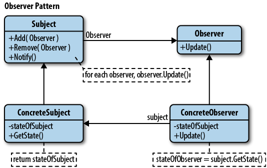
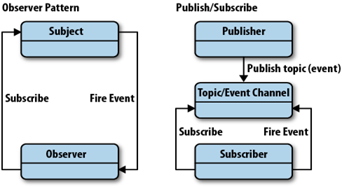

[Observer pattern](https://en.wikipedia.org/wiki/Observer_pattern)
---------------

The **observer pattern** is a [software design pattern](https://en.wikipedia.org/wiki/Design_pattern_(computer_science)) in which an [object](https://en.wikipedia.org/wiki/Object_(computer_science)#Objects_in_object-oriented_programming), called the **subject**, maintains a list of its dependents, called **observers**, and notifies them automatically of any state changes, usually by calling one of their [methods](https://en.wikipedia.org/wiki/Method_(computer_science)).

One or more observers are interested in the state of a subject and register their interest with the subject by attaching themselves. When something changes in our subject that the observer may be interested in, a notify message is sent which calls the update method in each observer. When the observer is no longer interested in the subject’s state, they can simply detach themselves.

It is mainly used to implement distributed [event handling](https://en.wikipedia.org/wiki/Event_handling) systems, in "event driven" software. Most modern languages such as Java and C\# have built in "event" constructs which implement the observer pattern components, for easy programming and short code.

Observer pattern is a key part in the familiar [model–view–controller](https://en.wikipedia.org/wiki/Model%E2%80%93view%E2%80%93controller) (MVC) architectural pattern

The observer pattern is implemented in numerous [programming libraries](https://en.wikipedia.org/wiki/Programming_library) and systems, including almost all [GUI](https://en.wikipedia.org/wiki/GUI) toolkits.

The observer pattern can cause [memory leaks](https://en.wikipedia.org/wiki/Memory_leak), known as the [lapsed listener problem](https://en.wikipedia.org/wiki/Lapsed_listener_problem), because in basic implementation it requires both explicit registration and explicit deregistration, as in the [dispose pattern](https://en.wikipedia.org/wiki/Dispose_pattern), because the subject holds strong references to the observers, keeping them alive. This can be prevented by the subject holding [weak references](https://en.wikipedia.org/wiki/Weak_reference) to the observers.

The observer pattern is implemented with the "subject" (which is being "observed") being part of the object who's state change is being observed, to be communicated to the observers upon occurrence.

This type of implementation is considered "[tightly coupled](https://en.wikipedia.org/wiki/Tightly_coupled_system)", forcing both the observers and the subject to be aware of each other and have access to their internal parts, creating possible issues of [scalability](https://en.wikipedia.org/wiki/Scalability), speed, message recovery and maintenance (also called event or notification loss)

In some ([non-polling](https://en.wikipedia.org/wiki/Polling_(computer_science))) implementations of the [publish-subscribe pattern](https://en.wikipedia.org/wiki/Publish-subscribe_pattern) (also called the pub-sub pattern), this is solved by creating a dedicated "message queue" server and at times an extra "message handler" object, as added stages between the observer and the observed object who's state is being checked, thus "decoupling" the software components. In these cases, the message queue server is accessed by the observers with the observer pattern, "subscribing to certain messages" knowing only about the expected message (or even that not), but knowing nothing about the message sender itself, and the sender may know nothing about the receivers.

The observer pattern is a very basic concept and does not deal with observance removal or with any conditional or complex logic handling to be done by the observed "subject" before or after notifying the observers.

The observer pattern also does not deal with recording the "events", the asynchronous passing of notifications or guaranteeing their being received. These concerns are typically dealt with in message queueing systems of which the observer pattern is only a small part.

> 
> 
---------------------------
>
> 

Below is an example written in [Java](https://en.wikipedia.org/wiki/Java_(programming_language)) that takes keyboard input and treats each input line as an event. The example is built upon the library classes [java.util.Observer](http://docs.oracle.com/javase/8/docs/api/java/util/Observer.html) and [java.util.Observable](http://docs.oracle.com/javase/8/docs/api/java/util/Observable.html). When a string is supplied from System.in, the method notifyObservers is then called, in order to notify all observers of the event's occurrence, in the form of an invocation of their 'update' methods.


```java
import java.util.Observable;
import java.util.Scanner;

class EventSource extends Observable implements Runnable {
    public void run() {
        while (true) {
            String response = new Scanner(System.in).next();
            setChanged();
            notifyObservers(response);
        }
    }
}
import java.util.Observable;
import java.util.Observer;

public class MyApp {
    public static void main(String[] args) {
        System.out.println("Enter Text: ");
        EventSource eventSource = new EventSource();

        eventSource.addObserver(new Observer() {
            public void update(Observable obj, Object arg) {
                System.out.println("Received response: " + arg);
            }
        });

        new Thread(eventSource).start();
    }
}
/*
interface Observer{
    public void update(Observable obj, Object arg);
}*/

```


**Publish–subscribe** is a [messaging pattern](https://en.wikipedia.org/wiki/Messaging_pattern) where senders of [messages](https://en.wikipedia.org/wiki/Message_passing), called publishers, do not program the messages to be sent directly to specific receivers, called subscribers, but instead characterize published messages into classes without knowledge of which subscribers, if any, there may be.

Similarly, subscribers express interest in one or more classes and only receive messages that are of interest, without knowledge of which publishers, if any, there are.

Publish–subscribe are a sibling of the [message queue](https://en.wikipedia.org/wiki/Message_queue) paradigm, and are typically one part of a larger [message-oriented middleware](https://en.wikipedia.org/wiki/Message-oriented_middleware) system.

Most messaging systems support both the pub/sub and message queue models in their [API](https://en.wikipedia.org/wiki/Application_programming_interface), e.g. [Java Message Service](https://en.wikipedia.org/wiki/Java_Message_Service) (JMS).

In publish–subscribe model, subscribers typically receive only a subset of the total messages published. The process of selecting messages for reception and processing is called *filtering*. There are two common forms of filtering: topic-based and content-based.

In a **topic-based** system, messages are published to "topics" or named logical channels. Subscribers in a topic-based system will receive all messages published to the topics to which they subscribe, and all subscribers to a topic will receive the same messages. The publisher is responsible for defining the classes of messages to which subscribers can subscribe.

In a **content-based** system, messages are only delivered to a subscriber if the attributes or content of those messages match constraints defined by the subscriber. The subscriber is responsible for classifying the messages.

**Loose coupling**: Publishers are [loosely coupled](https://en.wikipedia.org/wiki/Loose_coupling) to subscribers, and need not even know of their existence. With the topic being the focus, publishers and subscribers are allowed to remain ignorant of system topology. Each can continue to operate normally regardless of the other. In the traditional tightly coupled [client–server paradigm](https://en.wikipedia.org/wiki/Client%E2%80%93server_model), the client cannot post messages to the server while the server process is not running, nor can the server receive messages unless the client is running. 

**Scalability**: Pub/sub provides the opportunity for better [scalability](https://en.wikipedia.org/wiki/Scalability) than traditional client–server, through parallel operation, message caching, tree-based or network-based routing, etc.

> 

The most serious problems with pub/sub systems are a side-effect of their main advantage: the decoupling of publisher from subscriber.

**Inflexible Semantic coupling:** The structure of the data published must be well defined, and quickly becomes rather inflexible. In order to modify the published data structure, it would be necessary to know about all the Subscribers and either modify them also, or maintain compatibility with older versions. This makes refactoring of Publisher code much more difficult. Since requirements change over time, the inflexibility of the data structure becomes a burden on the programmer.

**Message Delivery Issues:** A pub/sub system must be designed carefully to be able to provide stronger system properties that a particular application might require, such as assured delivery.
